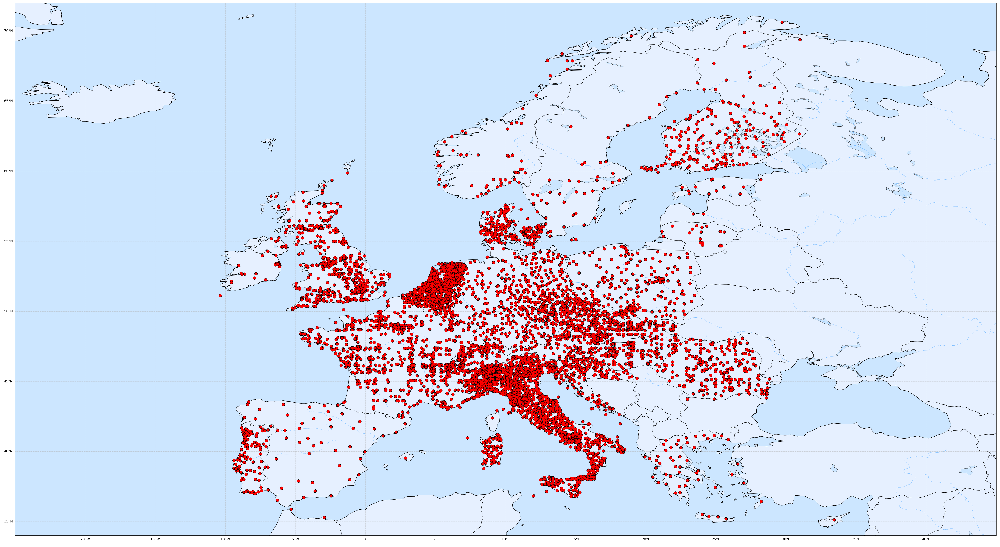
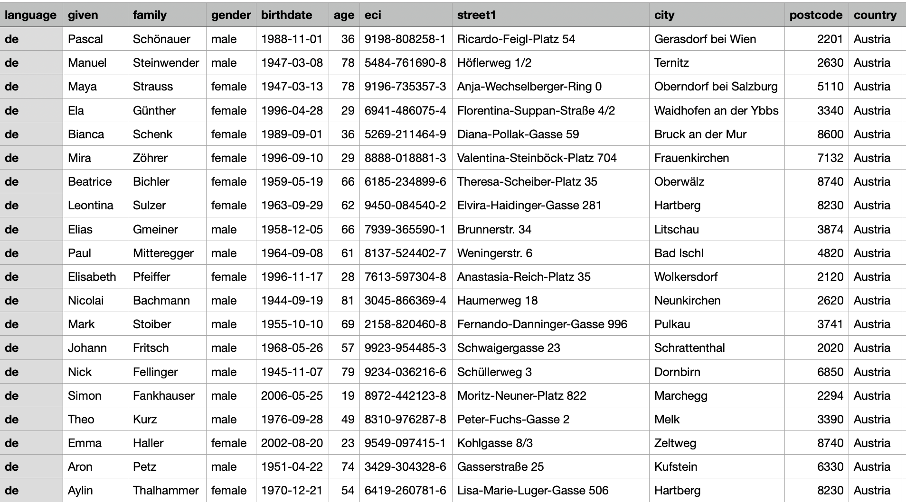
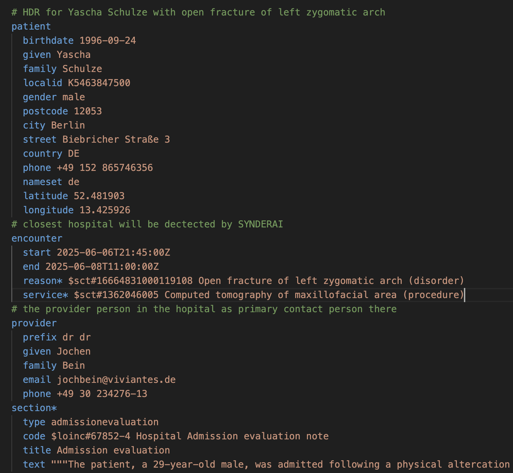

# Principles
**Synthetic Data: Examples – Realistic – using AI (SYNDERAI)**, pronounced **/ˈsɪn.də.raɪ/**

© [HL7 Europe](https://hl7europe.org) | Main Contributor: Dr. Kai U. Heitmann | [Privacy Policy](https://hl7europe.eu/privacy-policy-for-hl7-europe/) • LGPL-3.0 license

## Introduction

One of the recurring challenges in developing, testing, and validating HL7 FHIR-based systems is the availability of medically realistic, safe, and standards-compliant sets of example/test data. To address this, the [xShare Project](https://xshare-project.eu) integrates synthetic data generated under this initiative, coordinated by [HL7 Europe](https://hl7europe.org).

SYNDERAI provides synthetic, high-quality HL7 FHIR instances that replicate real-world clinical records without exposing personal health information. These instances are used across the xShare toolbox — from transformation to visualization to sharing — enabling fully privacy-compliant test workflows, aligned with the European Electronic Health Record Exchange Format (EEHRxF) and General Data Protection Regulation (GDPR, EU 2016/679) principles.

## SYNDERAI Design

SYNDERAI datasets are designed to

- **represent realistic clinical scenarios**, including medications, allergies, problems, encounters, vital signs, depending on the covered use case,
- **be conformant to HL7 FHIR Implementation Guides**, including IPS, EU Laboratory Report, and Hospital Discharge Summary,
- **use realistic but not real patient data**, ensuring safety in both development and demonstration environments.

The project generates not just HL7 FHIR JSON instance files, but also includes metadata, test coverage indicators, and placeholders for multilingual expansion and narrative descriptions. 

Within xShare, SYNDERAI synthetic data is

- used in architecture testbeds for **download, share, and visualize** flows, as seen at [vi7eti.net](https://vi7eti.net),
- prepared to support **IHE Connectathon/Plugathon test cases**
- embedded in **documentation and walk-throughs** as examples of valid HL7 FHIR structures and content.

This data enables **xShare Adoption Sites** and developers to

- run the **Yellow Button tools** without privacy concerns
- **simulate end-to-end workflows** with repeatable, traceable data
- **demonstrate compliance** with technical and legal requirements.

## Major Achievements

Following the design, a couple of achievements were made: European patient cohorts and providers were compiled, assuring some realistic properties. Clincial "stories" were combined with the individuals to create use case based data sets that are subsequently turned into the appropriate example/testing instances. Add use of AI at any of these levels where appropriate, e.g. prompting for populating data fragments based on a given demographic and clinical context or to provide human readable text based on exsting granular data.  

*Depositphotos.com © Robert Marmion*

### Patient cohorts, Provider crowds

#### Demographics

Large collections of synthetic human names residing in Europe with gender, language, birthdate and age, nationality, home address and geo coordinates were created using a couple of generators such as Faker, GeoPandas, Pycountry and Natural Earth Data. Please look at [Credits, Courtesy and Contributors](CCC.md) for details. 

|  |
| ------------------------------------------------------------ |
| *Figure 1: Geo-Localization of “patients” and  “providers” of Synthetic Example Realistic Data. The  example data is a randomized amalgamation of synthetic sources, bringing  stratification and other statistical methods into play.* |

The original idea was born with the **25tipster** initiative from 2020 where a start was made to generate 25.000 International Patient Summary (IPS) synthetic data sets. For SYNDERAI a set of more than 30.000 example demographic data sets were compiled. See the table below for an example snapshot of the data.

*Figure 2: Snapshot of the SYNDERAI generated synthetic demographic data set*

#### Synthea

[Synthea](https://synthetichealth.github.io/synthea/) from the MITRE Corporation is a well-known and mature synthetic data generator tool. It produces diagnoses, laboratory values, vital signs, immunizations and many more coded data in context. Patients are also included but they are typically US-centric. It also offers a set of international provider data such as hospitals or primary care providers.

For SYNDERAI the approach was chosen to use the Synthea clinical data, and associate the European demographic data with the US-data.

#### Stratification

For thast purpose, statistical methods also used for clinical trials (stratification [[1](#_ftn1)] of subjects) as well as AI technologies were applied to the two data sets. As stratification factors, gender and (almost same) age were chosen. 

| Nationality | Name          | Gender     | Age    |
| ----------- | ------------- | ---------- | ------ |
| **nl**      | **Assen**     | **female** | **79** |
| **nl**      | van de Kreeke | female     | 55     |
| **dk**      | Møller        | male       | 81     |
| **nl**      | Goorhuis      | male       | 82     |

*Example data for the startification strategy to combine different data sets to the SYNDERAI complete synthetic clinical stories*

Matching the Synthea clinical part with the European demographic data finally formed the "synthetic foundation" to draw a complete synthetic clinical story for all example artifactcs and for selected personas. With that, multiple cohesive laboratory report sequences, European Patient Summaries and more artifacts could be created.

#### Providers and Proximity

Synthea also offers a set of international provider data such as hospitals or primary care providers, including their "fake" addresses and geo locations. For matching the EU patients described above with at least a close-by provider, geo-proximity methods were applied to find hospitals or primary care physicians.

#### Personas

Finally a smaller set of personas were invented based on the described synthetic foundation. In selected cases, stories were defined for Hospital Discharge Reports that were completed by matching data. 

*Depositphotos.com © Yevhen Shkolenko*

#### Mappings of Coded Concepts

A certain effort was put into mapping coded concepts in the US-centric Synthea data set to coded concepts used in Europe. The mapping was documented in the ART-DECOR® tool and provided as concept maps for the example compiling algorithms. 

### AI in SYNDERAI

The use of **Artificial Intelligence** is applied to just fragments and parts of the complete "story", SYNDERAI tells, not to invent whole stories. 

For example, the compilation of the EU demographic data set uses AI to better locate and match pure demographic data with geo locations such as addresses etc.

The Laboratory Report is based on realistic lab values and projected on European citzizen/patients all over Europe, stratified [[1](#_ftn1)] by demographic and clinical factors to reach close clinical coverage. Only the normal lab value ranges based on the strata used is provided by concise calls to the AI API. A conclusion is drawn using AI per lab report, based on all prior synthetic lab reports for the respective patient.

Another example is the medication part where an appropriate dosage for a specific medication is proposed by AI. Also the existing Care Plans were complemented by human readable goals based on the coded activities that were generated for many synthetic clinical stories.

### The Human Text

Human reable text was also invented, partially with AI assistance, especially for the Hopsital Discharge Reports (HDR). In reality, HDR sections typically contain text along with granular data such as codes or measurements for medication, results, diagnoses, etc. 

For consistency in the example generating algorithms, a **Instance Short Hand** (ISH) notation was added to the tooling to allow concise description of instance contents while the actual generation of FHIR examples including identifiers and references used the same mechanisms as for the other artifacts.

## The xShare Yellow Button Story

SYNDERAI plays a critical role in enabling safe, reusable, and standards-aligned testing of the Yellow Button components. It supports transparency, traceability, and validation across the xShare toolbox — and provides a solid foundation for future testbeds, certification frameworks, and developer onboarding efforts in support of the EHDS.

Compared to the earlier xShare D3.3 deliverable, the SYNDERAI component has evolved significantly. What was previously described as a conceptual asset is now implemented and actively integrated into xShare workflows. The sets of example/test data is openly available, continuously expanded, and aligned with HL7 FHIR Implementation Guides such as IPS, EU Laboratory Report, and Hospital Discharge Summary.

It is now validated through real-world use in [visualization rendering via vi7eti](https://vi7eti.net), Smart Health Link generation, and IHE Connectathon/Plugathon test case development. These advancements make SYNDERAI a critical enabler for privacy-preserving, standards-compliant, and repeatable validation processes across the toolbox.

------

[[1](#_ftnref1)] *Stratification* of clinical trials is the partitioning of subjects and results by a factor other than the treatment given. – see Wikipedia https://en.wikipedia.org/wiki/Stratification_(clinical_trials)
