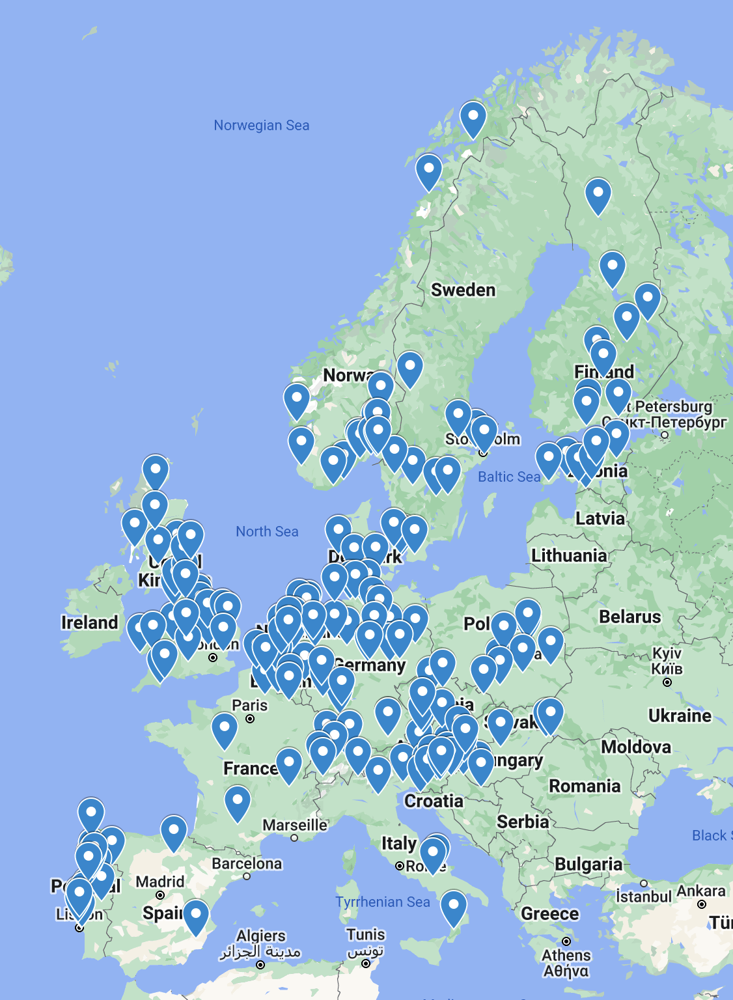

# SYNDERAI – the Story
**Synthetic Data: Examples – Realistic – using AI (SYNDERAI)**, pronounced **/ˈsɪn.də.raɪ/**

© dr Kai Heitmann, [HL7 Europe](https://hl7europe.org) | [Privacy Policy](https://hl7europe.eu/privacy-policy-for-hl7-europe/) • LGPL-3.0 license

## Synthetic Example Data

The xSHARE toolbox (D3.3) arranges tools that support proper implementation of the European EHRxF. 

For this set of deliverables, Synthetic Example Data is created on the base of the EHRxF specifications. The purpose of Synthetic Example Data is seen in testing and validation (e.g. industry proofs, connect-a-thons etc.) as well as in education and further implementation support for vendors.

Granular facts for Synthetic Example Data are subject to real medical knowledge. Create data just randomly may result in very unlikely data from a clinical perspective such as a child with a myocardial infarction or a grandmother with Type 1 Diabetes. Therefor designing examples need to be as close as possible to real medical workflows, as if they would be able to support care. In addition, supportive data and narrative / text can be generated by AI giving the precise instructions (e.g. granular data as the source). This also applies to tabular data (lab, meds) and (semi structured) text for the human target (e.g. Hospital Discharge Report).

HL7 Europe started this effort with a focus on Synthetic Example Data with a “real” medical background – as if from or for “real” care – but “invented” matching patient demographics. This is done using several sources of generated data, amalgamating it with additional localized data (for geolocation of the synthetic patients and providers, see figure 1) and statistical methods also used for clinical trials (stratification [[1](#_ftn1)] of subjects) as well as AI technologies to supplement data for the created strata and synthetic clinical story.

|  | *Figure 1: Geo-Localization of “patients” and  “providers” in the first wave of Synthetic Example Realistic Data. The  example data is a randomized amalgamation of synthetic sources, bringing  stratification and other statistical methods into play.* |
| ----------------------------- | ------------------------------------------------------------ |
|                               |                                                              |

The **Synthetic Example Realistic Data and AI (SYNERDAI)** methodology emitted the first 200 HL7 Europe Laboratory Report (EU-Lab) in October 2024, based on the HL7 Europe Laboratory Report FHIR Implementation Guide [[2](#_ftn2)] which is the implementation specification of the eHN Laboratory Result Guidelines [[3](#_ftn3)]. The other areas of specification will be submitted as a follow-up covering the Hospital Discharge Report, the European Patient Summary and others. The instances are available publicly.

The generation of Synthetic Example Data was also combined with a reference implementation of **Visualization** of the Synthetic Example Instances. For more information on this activity, refer to the GitHub repository [[4](#_ftn4)].

------

[[1](#_ftnref1)] *Stratification* of clinical trials is the partitioning of subjects and results by a factor other than the treatment given. – see Wikipedia https://en.wikipedia.org/wiki/Stratification_(clinical_trials)

[[2](#_ftnref2)] See https://build.fhir.org/ig/hl7-eu/laboratory/

[[3](#_ftnref3)] See https://health.ec.europa.eu/publications/ehn-laboratory-result-guidelines_en

[[4](#_ftnref4)] See https://github.com/hl7-eu/vi7eti
