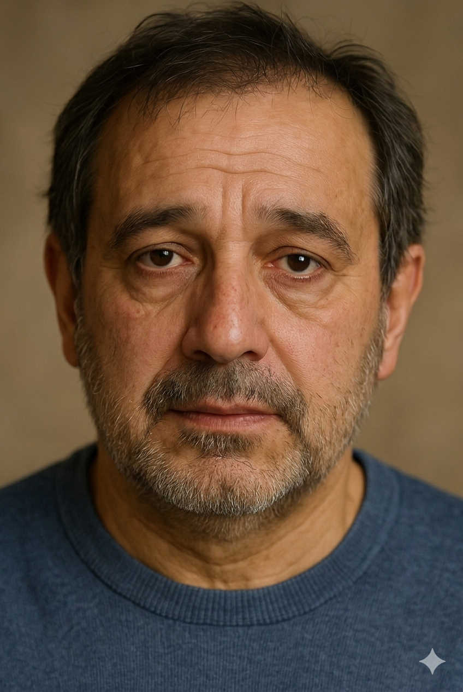

# Luigi De Luca

| **Patient  Name**:  **Luigi De Luca**                        | **Local ID**:  8121c77e7bf9                                  |
| ------------------------------------------------------------ | ------------------------------------------------------------ |
| **Date of  Birth** 30 September 1966 (age 60) **Sex** Male | **Address** Via Zannoni 29, 38057 Serso, Italy **Phone** +39 0334 8920354 |

| Hospital Stay             | **Details**                    |
| ------------------------- | ------------------------------ |
| **Admission**             | 1 April 2025 CET               |
| **Discharge**             | 10 April 2025 CET              |
| **Length of Stay**        | 10 days                        |
| **Admitting Service**     | Endocrinology                  |
| **Hospital**              | Santa Chiara  38122 Trento |
| **Responsible Physician** | Augusto Zucchero-Combattente   |

During the hospital stay from 1 to 10 April, Mr. De Luca underwent a series of diagnostic tests, consultations and initial treatment. 

Throughout his hospital stay, Mr. De Luca was monitored closely. His blood sugar levels improved modestly with the introduction of Metformin, and no acute complications were observed.