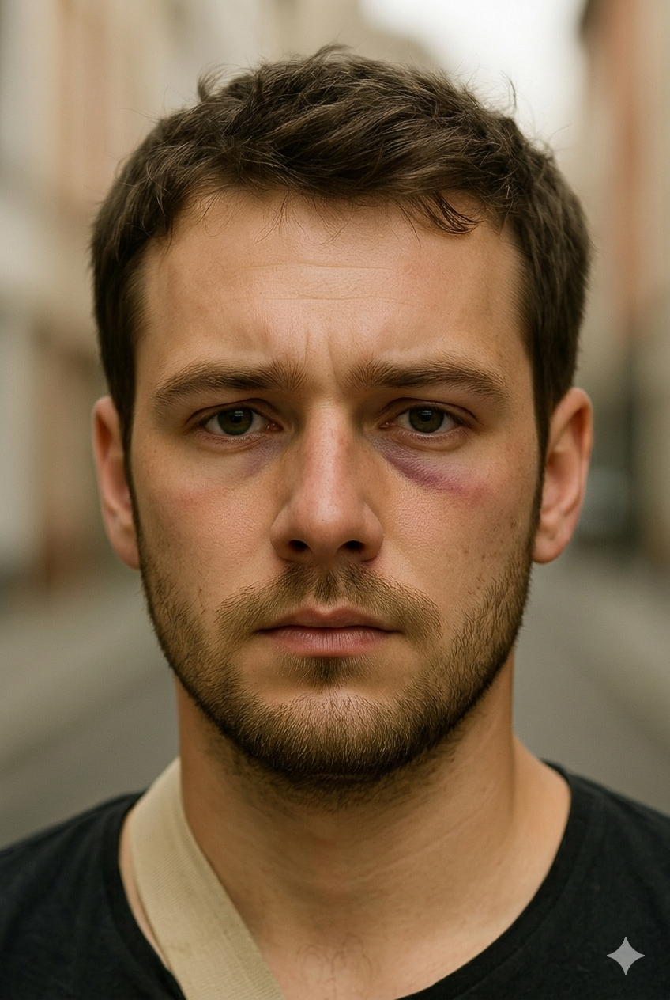
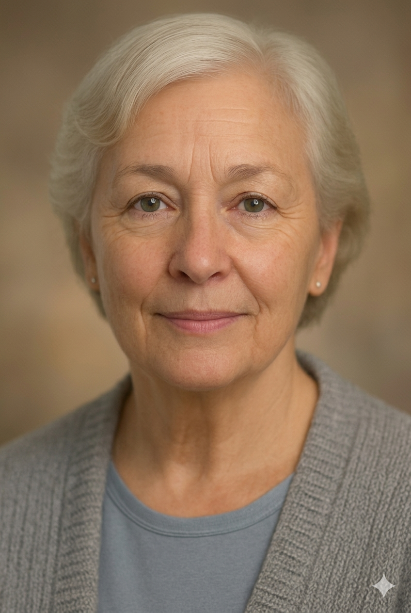

**Synthetic Data: Examples – Realistic – using AI (SYNDERAI)**, pronounced **/ˈsɪn.də.raɪ/**

© [HL7 Europe](https://hl7europe.org) | Main Contributor: Dr. Kai U. Heitmann | [Privacy Policy](https://hl7europe.eu/privacy-policy-for-hl7-europe/) • AGPL-3.0 license

# SYNDERAI – Personas

During the xShare project several "personas" where created to demonstrate the different features and solutions. Also in SYNDERAI there were some personas created for whom artifatcs were published.

This is the list of SYNDERAI personas.

## Yascha Schulze, 29 yr male

# Yascha Schulze

| **Patient  Name**:  **Yascha  Schulze**                      | **Local ID**:  K5463847500                                   |
| ------------------------------------------------------------ | ------------------------------------------------------------ |
| **Date of  Birth** 24 September 1996 (age 29) **Sex** Male | **Address** Biebricher Str. 3, 12053 Berlin **Phone** +49 152 865746356 |

| Hospital Stay             | **Details**                                                  |
| ------------------------- | ------------------------------------------------------------ |
| **Admission**             | 06 June 2025,  21:45 CET                                     |
| **Discharge**             | 08 June 2025,  11:00 CET                                     |
| **Length of Stay**        | 2 days                                                       |
| **Admitting Service**     | Oral &  Maxillofacial Surgery                                |
| **Hospital**              | Vivantes Klinikum am Urban Dieffenbachstraße 1, 10967 Berlin, Germany phone +49 30 234276-0 |
| **Responsible Physician** | Dr. Dr. Jochen  Bein \| email jochbein@viviantes.de \|phone +49 30 234276-13 |

Yascha, a 29-year-old male, was admitted following a physical altercation in Berlin-Neukölln, during which he sustained blunt trauma to the left side of the face. 

On presentation, clinical findings included a prominent facial contusion and swelling over the left zygomatic region. Palpation suggested underlying bone discontinuity. CT imaging confirmed a displaced left zygomatic arch fracture.

A surgical intervention under general anesthesia was performed for open reduction and internal fixation (ORIF) of the zygomatic fracture. Stabilization was achieved using titanium mini-plates and screws. The surgical wound was closed in layers with absorbable sutures.

The postoperative period was uneventful. Pain was adequately managed, and there were no signs of infection, wound dehiscence, or sensory disturbances. The patient received standard post-op wound care and showed good initial healing progress.

## Ingrid Arvidson, 84 yr female

# Ingrid Arvidson

| **Patient  Name**:  **Ingrid Arvidson**                      | **Local ID**:  f4e1b83d9c20                                  |
| ------------------------------------------------------------ | ------------------------------------------------------------ |
| **Date of  Birth** 30 September 1940 (age 84) **Sex** Female | **Address** Dadelvägen 56, 280 60 Broby, Sweden **Phone** +46 44 471 50 64 |

| Hospital Stay             | **Details**                                                  |
| ------------------------- | ------------------------------------------------------------ |
| **Admission**             | 2 February 2025 CET                                          |
| **Discharge**             | 12 February 2025 CET                                         |
| **Length of Stay**        | 11 days                                                      |
| **Admitting Service**     | Cardiology                                                   |
| **Hospital**              | Centralsjukhuset Kristianstad J A Hedlunds väg 5, 291 33 Kristianstad, Sweden phone +46 44 309 10 00 |
| **Responsible Physician** | dr Lasse Blomsterfröer \|phone +46 44 309 10 00              |

On admission (Day 0), Mrs. Arvidson presented with dyspnoea, bilateral leg oedema, and pulmonary crepitations. Troponin I was 400 ng/L. An ECG and chest X-ray were obtained. Intravenous diuretics and oxygen therapy were commenced immediately.

On Day 1, an urgent echocardiogram confirmed reduced ejection fraction and significant aortic valve stenosis. NT-proBNP, renal function, and repeat cardiac markers were obtained. The heart team was convened to assess suitability for valve intervention.

On Day 2, diagnostic cardiac catheterization was performed. Aortography demonstrated severe aortic valve dysfunction with 3+ to 4+ contrast backflow into a dilated left ventricle. Left ventricular ejection fraction was estimated at 40% from contrast ventriculography.

On Day 3, the multidisciplinary heart team meeting concluded that surgical aortic valve replacement carried prohibitive risk given the patient's advanced age and clinical frailty. Transcatheter Aortic Valve Implantation (TAVI) was indicated and scheduled accordingly.

Between Days 4 and 7, the TAVI procedure was successfully performed without intraoperative complications. The patient was transferred to the coronary care unit for post-procedural monitoring and was observed for rhythm disturbances, vascular access complications, and neurological status.

From Days 8 to 14 (discharge), Mrs. Arvidson demonstrated progressive clinical improvement. Troponin I declined to 200 ng/L by the time of discharge. Diuretic therapy and heart failure medications were continued and titrated. The patient was discharged on 12th February 2025 in stable condition.

## Luidi De Luca, 60 yr male

# Luigi De Luca

| **Patient  Name**:  **Luigi De Luca**                        | **Local ID**:  8121c77e7bf9                                  |
| ------------------------------------------------------------ | ------------------------------------------------------------ |
| **Date of  Birth** 30 September 1966 (age 60) **Sex** Male | **Address** Via Zannoni 29, 38057 Serso, Italy **Phone** +39 0334 8920354 |

| Hospital Stay             | **Details**                    |
| ------------------------- | ------------------------------ |
| **Admission**             | 1 April 2025 CET               |
| **Discharge**             | 10 April 2025 CET              |
| **Length of Stay**        | 10 days                        |
| **Admitting Service**     | Endocrinology                  |
| **Hospital**              | Santa Chiara  38122 Trento |
| **Responsible Physician** | Augusto Zucchero-Combattente   |

During the hospital stay from 1 to 10 April, Mr. De Luca underwent a series of diagnostic tests, consultations and initial treatment. 

Throughout his hospital stay, Mr. De Luca was monitored closely. His blood sugar levels improved modestly with the introduction of Metformin, and no acute complications were observed.
